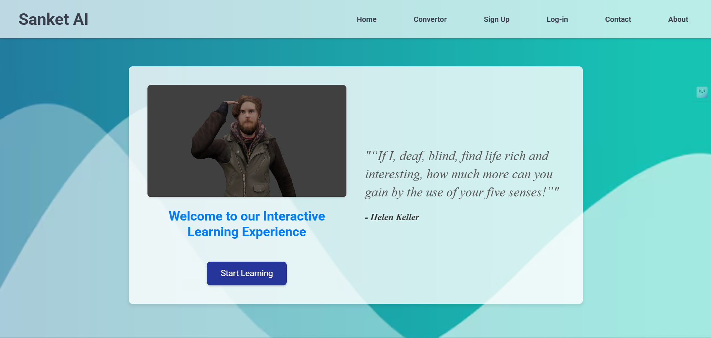
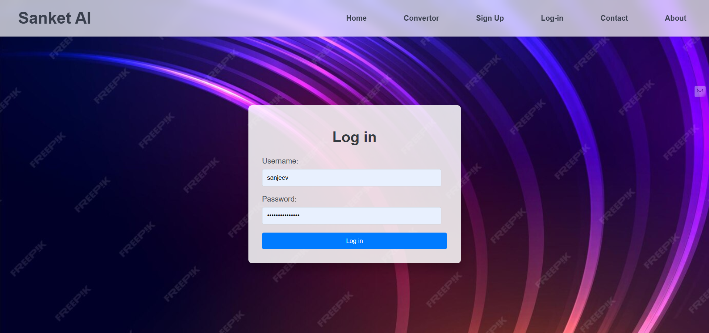
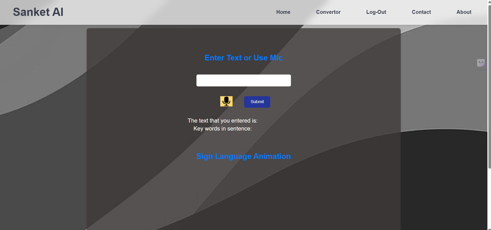

# ✨ sanket.ai — Audio Speech → Indian Sign Language ✨

A fun and interactive web app 🎤➡️📝➡️🤟 that captures live speech, converts it into text, and brings it to life with **Indian Sign Language (ISL)** animations.

## 🌟 What it does

* 🎙️ **Record speech** directly in the browser.
* 📝 **Preprocess text** and map words/phrases to ISL.
* 🎬 **Play 3D sign animations** created in Blender.

## 🛠️ Tech stack

* 💻 **Front end:** HTML, CSS, JavaScript
* 🎤 **Speech recognition:** Web Speech API (browser support required)
* 🧠 **Text processing:** NLTK (Python)
* 🎨 **Animations:** Blender 3D clips

## 📋 Prerequisites

* 🐍 **Python** ≥ 3.9
* 🌐 Browser that supports **Web Speech API**
* 📦 Install Python dependencies for the server (e.g., `views.py`)

## 🚀 Quick start

1. 📂 Open your project folder in a terminal.
2. ▶️ Run the server:

   ```bash
   python manage.py runserver [PORT]
   ```

   *(default: **8000**)*
3. 🌍 Open in browser: `http://127.0.0.1:8000/`
4. 👤 Sign up / Log in.
5. 🎙️ Click the **mic** button to record.
6. 🤟 Watch the **ISL animations** for your speech (or type text manually).

## 🖼️ App flow (screens)

**1️⃣ Main page**



**2️⃣ Login**



**3️⃣ Record audio**



**4️⃣ Result (ISL output)**


---

### 💡 Notes

* 🎥 Keep animation assets organized (e.g., `/assets/animations`).
* 🌐 For best results, use Chrome (great Web Speech API support).
* 🎤 If the mic permission is blocked, enable it in browser settings and reload.

✨ Enjoy learning Indian Sign Language with **sanket.ai**! 🤩
